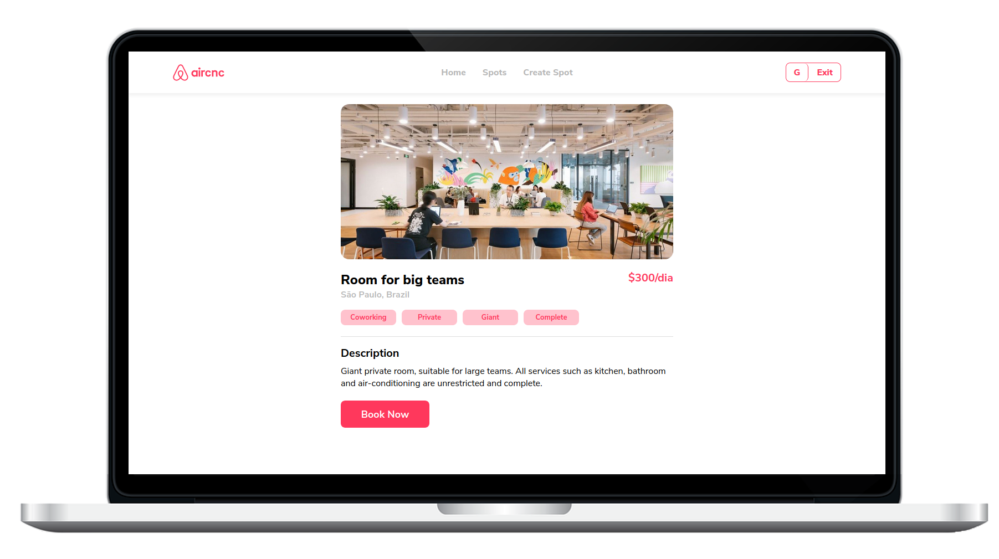

  

<h3 align="center">
  Find and offer hosting places
</h3>

  :coffee: Study fullstack project that aims to replicate Airbnb and it's basic functionalities
   
  Made on the Omnistack Week, by <a href="https://github.com/Rocketseat">Rocketseat</a>.

  

  

  

  

  

---

  

## :electric_plug: Backend

A **RESTful API** created with *Node.js* and *Typescript*.
See [DOCUMENTATION](blob/master/backend/DOCUMENTATION.md) of API for more details.

### :rocket: Main technologies
| Name | Description |
| - | - |
|[Node.js](https://nodejs.org) | Javascript interpreter |
|[Typescript](https://typescriptlang.org) | Language that adds type in javascript |
|[ESLint](https://eslint.org) | Ecmascript linter |
|[Express](https://expressjs.com) | Standard server structure |
|[MongoDB](https://www.mongodb.com) | NoSQL database |
|[Mongoose](https://mongoosejs.com) | Here used as query and schema builder |
|[JSON Web Token](https://github.com/auth0/node-jsonwebtoken) | Token pattern |
|[Multer](https://github.com/expressjs/multer) | File upload middleware |
|[CORS](https://github.com/expressjs/cors) | Express cors |

## :computer: Web app

**React** application with *Typescript*. **Features**: Mobile Friendly, create and login an account, create and booking a spot.

## :clipboard: License

This project is licensed under the MIT License - see the [LICENSE](LICENSE) file for details.

---

Made with :sparkling_heart: by Gabriel Ribeiro